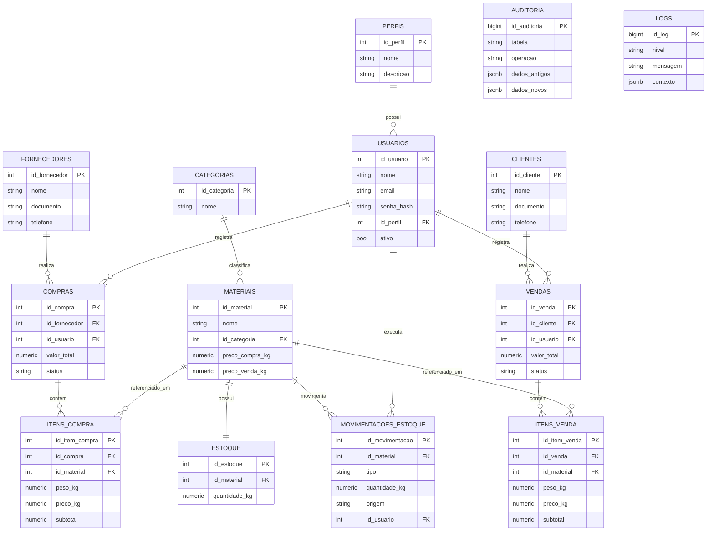

# Documentação — Banco de Dados Ferro-Velho / Reciclagem

**SGBD:** PostgreSQL 16
**Schema:** `ferro_velho`
**Banco:** `ferro_velho_db`
**Testado em:** PostgreSQL 16.14 (todos os scripts foram executados e validados de ponta a ponta neste documento)

---

## 1. Visão geral

Sistema de gestão para um ferro-velho / central de reciclagem de metais, cobrindo:
cadastro de usuários e perfis de acesso, clientes, fornecedores, categorias e materiais,
controle de estoque em tempo real, compras e vendas com itens, histórico de
movimentações (kardex), auditoria de alterações e log técnico da aplicação.

### Arquivos entregues

| Arquivo | Conteúdo |
|---|---|
| `00_instalar_tudo.sql` | Executa todos os scripts abaixo, na ordem correta |
| `01_ddl.sql` | Criação de schema, extensões e as 14 tabelas |
| `02_indices.sql` | Índices de performance (FK, busca textual, parciais) |
| `03_triggers.sql` | Funções e triggers (estoque automático, auditoria, timestamps) |
| `04_views.sql` | 8 views de relatório/consulta |
| `05_procedures.sql` | Procedures e functions de negócio |
| `06_dml.sql` | Carga inicial de dados (seed) + transações de exemplo |
| `07_dcl.sql` | Roles, usuários de serviço e permissões (GRANT/REVOKE) |
| `documentacao.md` | Este documento (MER, modelo lógico, físico, dicionário de dados) |

### Como instalar

```bash
createdb ferro_velho_db
psql -U seu_usuario -d ferro_velho_db -f 00_instalar_tudo.sql
```

---

## 2. MER — Modelo Entidade-Relacionamento



---

## 3. Modelo lógico (resumo das relações)

- **PERFIS (1) — (N) USUARIOS**: um perfil (ADMIN/OPERADOR/LEITURA) é usado por vários usuários.
- **USUARIOS (1) — (N) COMPRAS / VENDAS / MOVIMENTACOES_ESTOQUE**: todo lançamento fica ligado a quem operou.
- **FORNECEDORES (1) — (N) COMPRAS**, **CLIENTES (1) — (N) VENDAS**.
- **CATEGORIAS (1) — (N) MATERIAIS**: classificação (ferrosos, não ferrosos, eletrônicos, baterias).
- **MATERIAIS (1) — (1) ESTOQUE**: saldo atual por material.
- **COMPRAS (1) — (N) ITENS_COMPRA** e **VENDAS (1) — (N) ITENS_VENDA**: cabeçalho/itens (nota fiscal).
- **MATERIAIS (1) — (N) MOVIMENTACOES_ESTOQUE**: kardex — todo ENTRADA/SAIDA/AJUSTE é rastreado.
- **AUDITORIA** e **LOGS** são tabelas independentes, alimentadas por trigger (auditoria) e pela aplicação (logs).

Todas as FKs usam `ON UPDATE CASCADE`; `ON DELETE` varia por sensibilidade
(`RESTRICT` para preservar histórico financeiro, `CASCADE` só em
estoque/itens que são dependentes diretos do material/documento pai).

---

## 4. Modelo físico (tipos de dado escolhidos)

| Tipo de dado PostgreSQL | Uso |
|---|---|
| `SERIAL` / `BIGSERIAL` | Chaves primárias auto-incrementais |
| `VARCHAR(n)` | Textos curtos com tamanho previsível (nomes, e-mails, documentos) |
| `TEXT` | Mensagens de log sem tamanho fixo |
| `NUMERIC(10,2)` / `NUMERIC(12,2)` | Valores monetários e pesos — evita erro de arredondamento do `FLOAT` |
| `NUMERIC ... GENERATED ALWAYS AS (...) STORED` | `subtotal` calculado automaticamente pelo banco (peso × preço) |
| `BOOLEAN` | Flags (ativo/inativo) |
| `TIMESTAMP` | Datas/horas de eventos, com `DEFAULT now()` |
| `JSONB` | Dados semiestruturados de auditoria/log (antes/depois, contexto) |
| `CHECK` | Domínios fechados (status, tipo de movimentação, nível de log) no lugar de tabelas de domínio extras |

---

## 5. Dicionário de dados

### 5.1 `perfis`
| Coluna | Tipo | Regras |
|---|---|---|
| id_perfil | SERIAL PK | |
| nome | VARCHAR(50) | UNIQUE, NOT NULL |
| descricao | VARCHAR(255) | |
| criado_em | TIMESTAMP | DEFAULT now() |

### 5.2 `usuarios`
| Coluna | Tipo | Regras |
|---|---|---|
| id_usuario | SERIAL PK | |
| nome | VARCHAR(150) | NOT NULL |
| email | VARCHAR(150) | UNIQUE, NOT NULL, formato validado por CHECK |
| senha_hash | VARCHAR(255) | NOT NULL — armazenar sempre com hash (bcrypt via `pgcrypto`), nunca texto puro |
| id_perfil | INT FK → perfis | NOT NULL |
| ativo | BOOLEAN | DEFAULT TRUE |
| criado_em / atualizado_em | TIMESTAMP | atualizado_em mantido por trigger |

### 5.3 `clientes` / `fornecedores`
| Coluna | Tipo | Regras |
|---|---|---|
| id_cliente / id_fornecedor | SERIAL PK | |
| nome | VARCHAR(150) | NOT NULL |
| documento | VARCHAR(20) | UNIQUE (CPF/CNPJ), aceita NULL (ex.: "Consumidor Final") |
| telefone, email, endereco | VARCHAR | opcionais |
| ativo | BOOLEAN | DEFAULT TRUE |

### 5.4 `categorias`
| Coluna | Tipo | Regras |
|---|---|---|
| id_categoria | SERIAL PK | |
| nome | VARCHAR(80) | UNIQUE, NOT NULL |

### 5.5 `materiais`
| Coluna | Tipo | Regras |
|---|---|---|
| id_material | SERIAL PK | |
| nome | VARCHAR(120) | UNIQUE, NOT NULL |
| id_categoria | INT FK → categorias | ON DELETE SET NULL |
| unidade_medida | VARCHAR(10) | DEFAULT 'kg' |
| preco_compra_kg / preco_venda_kg | NUMERIC(10,2) | CHECK >= 0 |
| ativo | BOOLEAN | DEFAULT TRUE |

### 5.6 `estoque`
| Coluna | Tipo | Regras |
|---|---|---|
| id_estoque | SERIAL PK | |
| id_material | INT FK → materiais | UNIQUE (relação 1:1), ON DELETE CASCADE |
| quantidade_kg | NUMERIC(12,2) | CHECK >= 0 — **nunca fica negativo** graças à trigger de validação |
| atualizado_em | TIMESTAMP | mantido por trigger |

### 5.7 `compras` / `vendas`
| Coluna | Tipo | Regras |
|---|---|---|
| id_compra / id_venda | SERIAL PK | |
| id_fornecedor / id_cliente | INT FK | NOT NULL, ON DELETE RESTRICT |
| id_usuario | INT FK → usuarios | NOT NULL |
| data_compra / data_venda | TIMESTAMP | DEFAULT now() |
| valor_total | NUMERIC(12,2) | recalculado automaticamente por trigger a partir dos itens |
| status | VARCHAR(20) | CHECK IN ('CONCLUIDA','CANCELADA') |

### 5.8 `itens_compra` / `itens_venda`
| Coluna | Tipo | Regras |
|---|---|---|
| id_item_compra / id_item_venda | SERIAL PK | |
| id_compra / id_venda | INT FK | ON DELETE CASCADE |
| id_material | INT FK → materiais | ON DELETE RESTRICT |
| peso_kg | NUMERIC(10,2) | CHECK > 0 |
| preco_kg | NUMERIC(10,2) | CHECK >= 0 |
| subtotal | NUMERIC(12,2) | **coluna gerada** (`peso_kg * preco_kg`) |

### 5.9 `movimentacoes_estoque`
| Coluna | Tipo | Regras |
|---|---|---|
| id_movimentacao | SERIAL PK | |
| id_material | INT FK → materiais | |
| tipo | VARCHAR(10) | CHECK IN ('ENTRADA','SAIDA','AJUSTE') |
| quantidade_kg | NUMERIC(12,2) | CHECK > 0 |
| origem | VARCHAR(20) | CHECK IN ('COMPRA','VENDA','AJUSTE_MANUAL') |
| id_referencia | INT | id da compra/venda de origem (sem FK física, é polimórfico) |
| id_usuario | INT FK → usuarios | ON DELETE SET NULL |

### 5.10 `auditoria`
| Coluna | Tipo | Regras |
|---|---|---|
| id_auditoria | BIGSERIAL PK | |
| tabela | VARCHAR(50) | nome da tabela auditada |
| operacao | VARCHAR(10) | CHECK IN ('INSERT','UPDATE','DELETE') |
| dados_antigos / dados_novos | JSONB | snapshot da linha antes/depois |
| data_hora | TIMESTAMP | DEFAULT now() |

### 5.11 `logs`
| Coluna | Tipo | Regras |
|---|---|---|
| id_log | BIGSERIAL PK | |
| nivel | VARCHAR(10) | CHECK IN ('DEBUG','INFO','WARNING','ERROR') |
| mensagem | TEXT | NOT NULL |
| contexto | JSONB | dados livres (request_id, payload, etc.) |

---

## 6. Regras de negócio implementadas via trigger

1. **Entrada automática de estoque** — ao inserir um `item_compra`, o estoque do
   material é somado, uma linha em `movimentacoes_estoque` (ENTRADA) é criada
   e o `valor_total` da compra é recalculado.
2. **Saída de estoque com validação de saldo** — ao inserir um `item_venda`,
   uma trigger `BEFORE INSERT` verifica se há saldo suficiente; se não houver,
   a transação inteira é revertida com `RAISE EXCEPTION` (testado: bloqueia
   corretamente vendas acima do saldo disponível).
3. **Auditoria automática** — qualquer INSERT/UPDATE/DELETE em `materiais`,
   `clientes`, `fornecedores`, `usuarios` e UPDATE em `estoque` gera uma linha
   em `auditoria` com o registro antes/depois em JSONB.
4. **Timestamps automáticos** — `atualizado_em` de `usuarios` e `estoque` é
   sempre atualizado pela própria trigger, sem depender da aplicação.

## 7. Procedures/Functions de negócio

- `sp_registrar_compra(fornecedor, usuario, itens jsonb)` — grava cabeçalho + itens em uma transação atômica.
- `sp_registrar_venda(cliente, usuario, itens jsonb)` — idem para vendas, com validação automática de estoque.
- `sp_ajustar_estoque(material, nova_quantidade, usuario, motivo)` — ajuste manual de inventário, gerando movimentação do tipo AJUSTE.
- `fn_relatorio_periodo(data_inicio, data_fim)` — retorna total comprado, total vendido e resultado bruto do período.
- `fn_hash_senha(senha)` — gera hash bcrypt (pgcrypto) para armazenar senha de usuário.

## 8. Views disponíveis

`vw_estoque_atual`, `vw_compras_por_fornecedor`, `vw_vendas_por_cliente`,
`vw_materiais_mais_vendidos`, `vw_movimentacoes_recentes`,
`vw_faturamento_diario`, `vw_usuarios_perfis`, `vw_margem_materiais`.

## 9. Segurança (DCL)

Três papéis de aplicação, seguindo o princípio do menor privilégio:

| Role | Permissão |
|---|---|
| `role_admin` | Acesso total (DDL/DML) no schema `ferro_velho` |
| `role_operador` | SELECT/INSERT/UPDATE nas tabelas operacionais; **sem** acesso a `auditoria` e `logs`; executa as procedures de compra/venda/ajuste |
| `role_leitura` | Apenas SELECT em tabelas e views de relatório; **sem** acesso a `usuarios`, `auditoria` ou `logs` |

Usuários de serviço (`app_admin`, `app_operador`, `app_leitura`) são criados
com senha placeholder — **trocar antes de usar em produção**. Senhas de
usuários do sistema (tabela `usuarios`) são sempre armazenadas com hash
bcrypt via `fn_hash_senha()` / extensão `pgcrypto`, nunca em texto puro.

## 10. Índices

Cobertura de todas as chaves estrangeiras, índices GIN com `pg_trgm` para
busca textual (nome de cliente/fornecedor/material), índices por data para
relatórios de período e índices parciais (`WHERE ativo = TRUE`) para acelerar
as consultas mais comuns do dia a dia.

## 11. Validação

Todos os scripts (`01` a `07`) foram executados sequencialmente em uma
instância real do **PostgreSQL 16.14**, incluindo:
- criação completa da estrutura sem erros;
- carga dos dados de exemplo;
- execução das procedures de compra e venda com atualização automática de
  estoque, movimentações e totais (conferido manualmente: 500kg de Ferro
  comprados − 50kg vendidos = 450kg em estoque; total da compra R$ 1.000,00;
  total da venda R$ 132,00 — valores batendo com o esperado);
- teste negativo de venda com saldo insuficiente, corretamente bloqueado e
  com rollback completo (sem registro órfão em `vendas`);
- geração de trilha de auditoria para os INSERT/UPDATE realizados.
