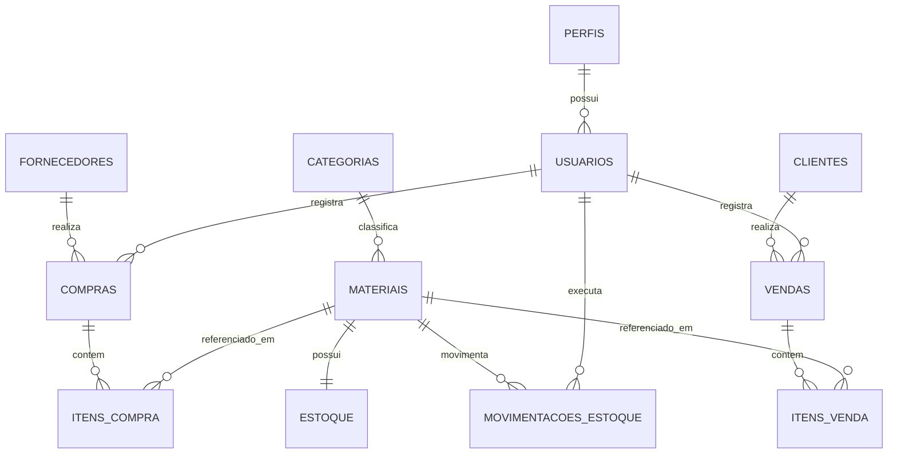

# ferro_velho_db

Banco de dados relacional para gestão de um ferro-velho / central de
reciclagem de metais — controle de compras, vendas, estoque, clientes,
fornecedores, usuários e auditoria.

---

## Visão geral

| | |
|---|---|
| **SGBD** | PostgreSQL 16 |
| **Nome do banco** | `ferro_velho_db` |
| **Schema** | `ferro_velho` |
| **Tabelas** | 14 |
| **Views** | 8 |
| **Procedures/Functions** | 5 |
| **Triggers** | 8 |
| **Roles de acesso** | 3 (`role_admin`, `role_operador`, `role_leitura`) |

---

## Stack tecnológica

| Tecnologia | Papel |
|---|--- |
| **PostgreSQL 16** | SGBD relacional — motor do banco |
| **PL/pgSQL** | Linguagem procedural nativa, usada em triggers, procedures e functions |
| **pgcrypto** (extensão) | Hash de senha (bcrypt) direto no banco |
| **pg_trgm** (extensão) | Índices de busca textual (nome de cliente/material/fornecedor) |
| **JSONB** | Armazenamento semiestruturado em auditoria e logs |
| **Colunas geradas** (`GENERATED ALWAYS AS ... STORED`) | Cálculo automático de subtotal (peso × preço) |
| **Roles/GRANT nativos do Postgres** | Controle de acesso, sem depender de camada extra |

Nenhuma dependência externa ao PostgreSQL — roda em qualquer provedor
(RDS, Supabase, Neon, Docker, servidor próprio) sem instalar nada além da
extensão `pgcrypto` e `pg_trgm`, que já vêm com o Postgres.

---

## Arquitetura

```
┌──────────────────────────────────────────────────────────────┐
│                      APLICAÇÃO (fora do BD)                    │
│           conecta como role_admin / role_operador / role_leitura│
└───────────────────────────┬──────────────────────────────────┘
                             ▼
┌──────────────────────────────────────────────────────────────┐
│                 POSTGRESQL 16 — ferro_velho_db                  │
│                     schema: ferro_velho                         │
│                                                                  │
│   CAMADA DE DADOS          CAMADA DE REGRAS       CAMADA DE     │
│   14 tabelas                8 triggers             ACESSO       │
│   PK / FK / CHECK /          (estoque automático,   3 roles com │
│   UNIQUE / DEFAULT           auditoria,             GRANT/REVOKE│
│                              timestamps)             por tabela  │
│                                                                  │
│   CAMADA DE CONSULTA        CAMADA DE OPERAÇÃO                  │
│   8 views                    5 procedures/functions              │
│   (relatórios prontos)       (compra, venda, ajuste de estoque,  │
│                               relatório de período, hash senha)  │
└──────────────────────────────────────────────────────────────┘
```

---

## Modelo de dados

### Entidades e relacionamentos



### Tabelas

| Tabela | Função |
|---|---|
| `perfis` | Tipos de acesso do sistema (ADMIN, OPERADOR, LEITURA) |
| `usuarios` | Contas de quem opera o sistema, com senha em hash |
| `clientes` | Quem compra material do ferro-velho |
| `fornecedores` | Quem vende/traz material para o ferro-velho |
| `categorias` | Agrupamento dos materiais (Ferrosos, Não Ferrosos, Eletrônicos, Baterias) |
| `materiais` | Catálogo de materiais, com preço de compra e de venda separados |
| `estoque` | Saldo atual (kg) de cada material — nunca fica negativo |
| `compras` | Cabeçalho das compras (fornecedor, usuário, valor total, status) |
| `itens_compra` | Materiais comprados em cada compra, com subtotal calculado pelo banco |
| `vendas` | Cabeçalho das vendas (cliente, usuário, valor total, status) |
| `itens_venda` | Materiais vendidos em cada venda, com validação automática de saldo |
| `movimentacoes_estoque` | Histórico completo de entrada, saída e ajuste de estoque (kardex) |
| `auditoria` | Registro automático de quem alterou o quê, com dado antes/depois |
| `logs` | Log técnico da aplicação |

---

## Regras de negócio automatizadas (triggers)

- **Compra registrada** → estoque sobe sozinho, movimentação `ENTRADA` é criada, `valor_total` da compra é recalculado.
- **Venda registrada** → banco valida se há saldo suficiente **antes** de gravar; se não houver, recusa a operação inteira (sem gravação parcial).
- **Venda confirmada** → estoque desce sozinho, movimentação `SAIDA` é criada, `valor_total` da venda é recalculado.
- **Alteração em `materiais`, `clientes`, `fornecedores`, `usuarios`, `estoque`** → gera automaticamente uma linha em `auditoria`, com o registro antes e depois em JSON.
- **Atualização de `usuarios` e `estoque`** → coluna `atualizado_em` se mantém sozinha, sem depender da aplicação lembrar de atualizar.

---

## Rotinas de negócio (procedures/functions)

| Rotina | Tipo | Função |
|---|---|---|
| `sp_registrar_compra(fornecedor, usuario, itens)` | Procedure | Grava uma compra inteira (cabeçalho + itens) em uma única transação |
| `sp_registrar_venda(cliente, usuario, itens)` | Procedure | Grava uma venda inteira, com validação automática de estoque |
| `sp_ajustar_estoque(material, nova_qtd, usuario, motivo)` | Procedure | Corrige estoque manualmente (inventário, perda), com motivo registrado |
| `fn_relatorio_periodo(data_inicio, data_fim)` | Function | Retorna total comprado, total vendido e resultado bruto do período |
| `fn_hash_senha(senha)` | Function | Gera hash bcrypt de senha para gravação segura |

---

## Relatórios prontos (views)

| View | Responde |
|---|---|
| `vw_estoque_atual` | Quanto tenho de cada material agora? |
| `vw_compras_por_fornecedor` | Quanto comprei de cada fornecedor? |
| `vw_vendas_por_cliente` | Quanto cada cliente já gastou? |
| `vw_materiais_mais_vendidos` | Quais materiais mais vendem, em kg e em R$? |
| `vw_movimentacoes_recentes` | O que entrou/saiu do estoque recentemente? |
| `vw_faturamento_diario` | Quanto faturei por dia? |
| `vw_usuarios_perfis` | Lista de usuários com perfil, sem expor senha |
| `vw_margem_materiais` | Qual a margem de lucro (%) de cada material? |

---

## Segurança e controle de acesso

| Role | Pode fazer |
|---|---|
| `role_admin` | Tudo — DDL e DML completos no schema |
| `role_operador` | Registrar compra/venda/ajuste de estoque, consultar tudo — sem acesso a `auditoria` e `logs`, sem apagar cadastro |
| `role_leitura` | Somente consulta às tabelas e views de relatório — sem acesso a `usuarios`, `auditoria` ou `logs` |

- Senhas de usuário: nunca em texto puro — sempre hash bcrypt via `pgcrypto`.
- Auditoria automática de alterações em dados sensíveis, sem depender da aplicação.
- Cada tipo de conexão (aplicação web, dashboard de BI, admin) deve usar o role correspondente ao seu nível de necessidade — nunca `role_admin` no uso do dia a dia.

---

## Índices

- Em todas as chaves estrangeiras, para acelerar `JOIN`.
- Em colunas de data (`data_venda`, `data_compra`), para acelerar relatórios por período.
- De busca textual (`pg_trgm`) em nome de cliente, fornecedor e material.
- Parciais (`WHERE ativo = TRUE`) nas tabelas de cadastro, para acelerar as consultas mais comuns do dia a dia.

---

## Integridade dos dados (constraints)

- `PRIMARY KEY` em toda tabela.
- `FOREIGN KEY` com `ON UPDATE CASCADE` e `ON DELETE` ajustado por sensibilidade (`RESTRICT` para preservar histórico financeiro, `CASCADE` para dados dependentes diretos).
- `UNIQUE` em e-mail de usuário, documento de cliente/fornecedor, nome de material/categoria.
- `CHECK` em peso (> 0), preço (>= 0), estoque (>= 0), status e tipos de movimentação (valores fechados).
- `NOT NULL` nos campos obrigatórios.
- `DEFAULT` em datas de criação, flags de ativo e status inicial.

---

## Estrutura de arquivos do projeto

```
ferro_velho_db/
├── 00_instalar_tudo.sql   → instala tudo, na ordem certa
├── 01_ddl.sql             → schema, extensões e as 14 tabelas
├── 02_indices.sql         → índices de performance
├── 03_triggers.sql        → funções e triggers de automação
├── 04_views.sql           → as 8 views de relatório
├── 05_procedures.sql      → procedures e functions de negócio
├── 06_dml.sql             → dados iniciais (seed)
├── 07_dcl.sql             → roles e permissões
└── documentacao.md        → MER completo, modelo lógico/físico, dicionário de dados
```

---

## Como instalar

```bash
createdb ferro_velho_db
psql -U seu_usuario -d ferro_velho_db -f 00_instalar_tudo.sql
```

Depois da instalação, troque as senhas placeholder dos roles de serviço
(`app_admin`, `app_operador`, `app_leitura`) definidas em `07_dcl.sql`.

---

## Exemplo de uso

```sql
-- Registrar uma compra
CALL sp_registrar_compra(
    1, -- id_fornecedor
    1, -- id_usuario
    '[{"id_material": 1, "peso_kg": 500, "preco_kg": 0.90}]'::jsonb
);

-- Registrar uma venda (falha automaticamente se não houver estoque)
CALL sp_registrar_venda(
    1, -- id_cliente
    2, -- id_usuario
    '[{"id_material": 1, "peso_kg": 50, "preco_kg": 1.20}]'::jsonb
);

-- Consultar estoque atual
SELECT * FROM vw_estoque_atual;

-- Faturamento por dia
SELECT * FROM vw_faturamento_diario;
```
